import { Callout } from 'nextra/components'

# 洛书南 · 社区皮肤站使用指南

<Callout emoji="🔔">
  目前社区皮肤站本体与指南均未完成，并非最终版本，正在努力完善中，敬请谅解。
</Callout>

## 创建账户

1. 访问 [皮肤站注册页面](https://user.losenone.cn/auth/signup)，页面显示如下图所示，即表示已成功进入注册界面。

   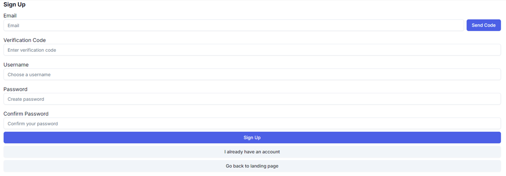

2. 按照下图提示，在 `Email` 栏中输入您的电子邮箱地址，然后点击 `Send Code` 按钮获取注册验证码。

   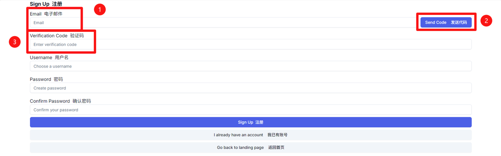

3. 打开您的邮箱，查找来自 “Losenone Accounts” 的验证码邮件，将其中的验证码复制，并粘贴到上图所示的验证码输入框中。

   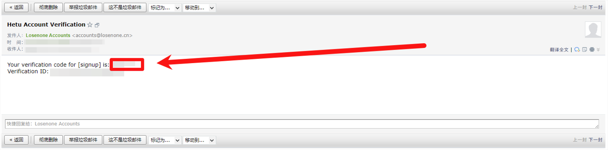

4. 依次填写您的用户名和密码，确认无误后点击 `Sign Up` 按钮，即可完成注册。

   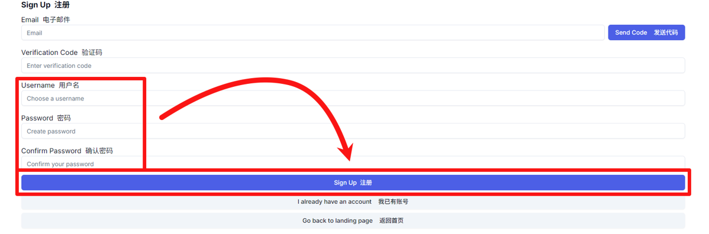

## 配置账户

1. 注册成功并登录后，您将回到皮肤站首页。点击右上角的 `App` 按钮，进入个人仪表盘界面。

   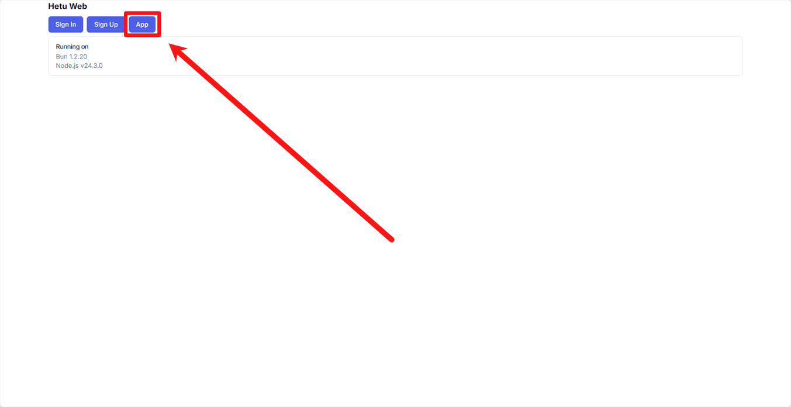

2. 在仪表盘顶部菜单中选择 `Profiles` 选项卡，点击 `Create profile` 按钮。在弹出的对话框中输入您的游戏 ID，确认无误后点击 `Create Profile`。

   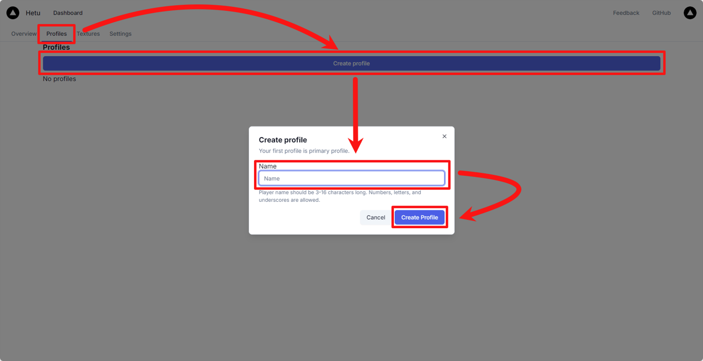

3. 切换到 `Textures` 选项卡，点击 `Create texture` 按钮。在弹出的窗口中填写以下信息：Name（皮肤名称）、Description（皮肤描述丨可选）、File（上传的皮肤文件）、Type（选择皮肤类型），确认无误后点击 `Create Texture`。

   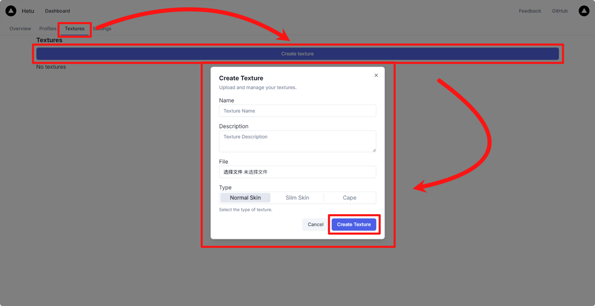

4. 在皮肤列表中找到刚上传的皮肤，点击 `Use` 按钮。在弹出的窗口中选择要应用的档案（Profile），即可完成皮肤绑定。

   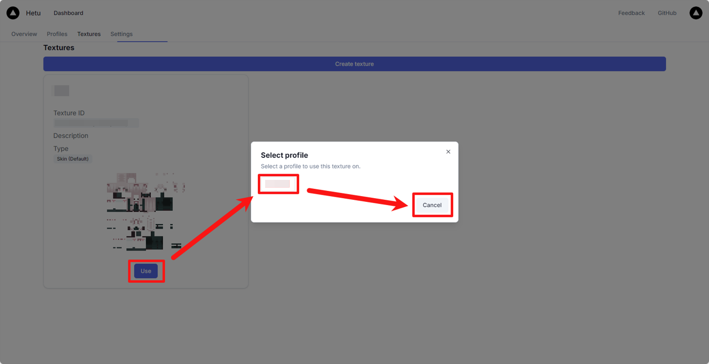

## 绑定正版账户（可选）

1. 在仪表盘顶部菜单中选择 `Settings` 选项卡，找到 `Mojang 正版验证` 栏目，并点击 `绑定 Minecraft 账号（Mojang 正版）` 按钮。

   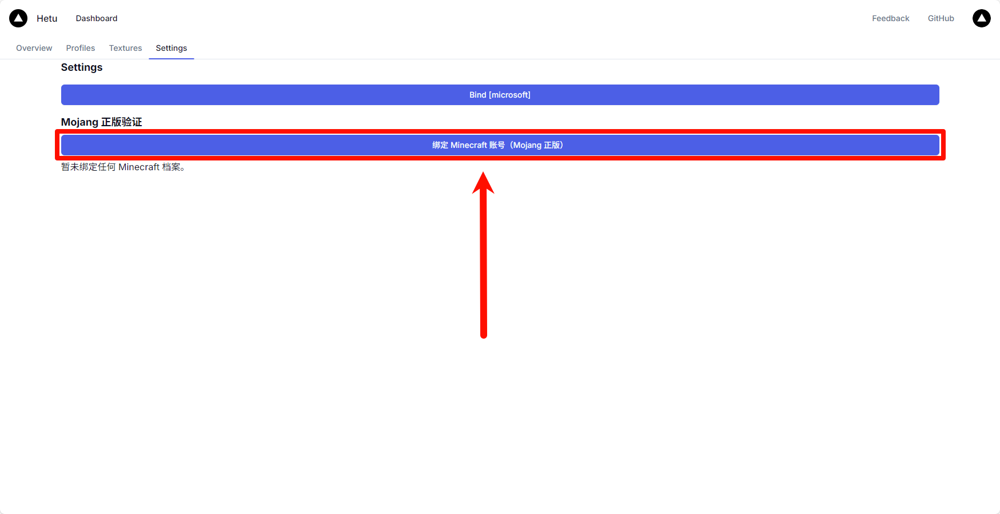

2. 网页自动会跳转至微软登录页面，选择已登录的微软账户，或点击使用其他账户登录输入您的正版 Minecraft 账号对应的微软凭证

   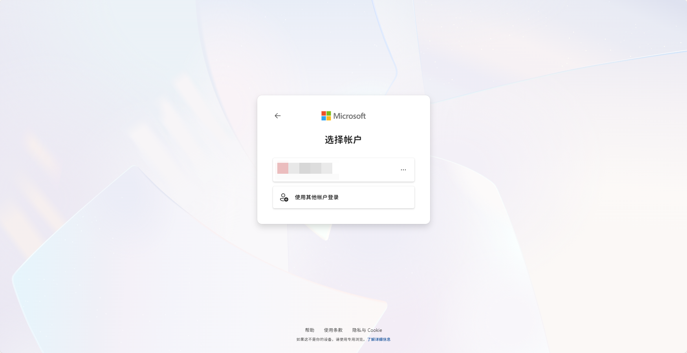

3. 登录微软账户后会出现权限请求页面，请点击 `接受` 授权皮肤站访问 Xbox Live 账户信息。

   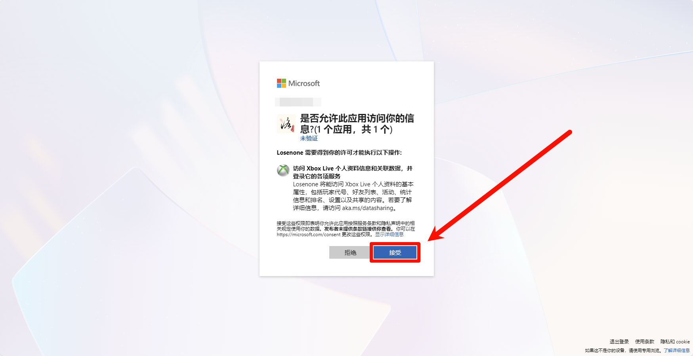

4. 授权成功后，页面会显示 `正在处理验证 …`，请稍候片刻。

   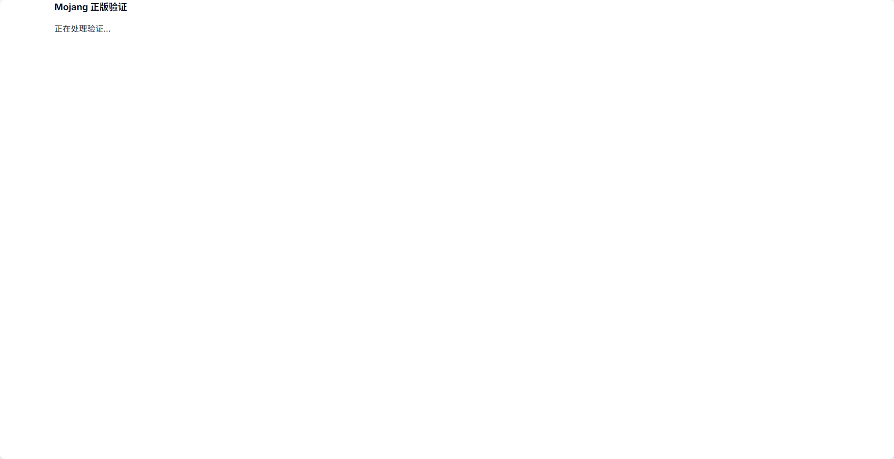

5. 验证完成后，将显示绑定成功的信息以及绑定的档案详细数据。点击 `返回设置页面` 可回到设置界面。

   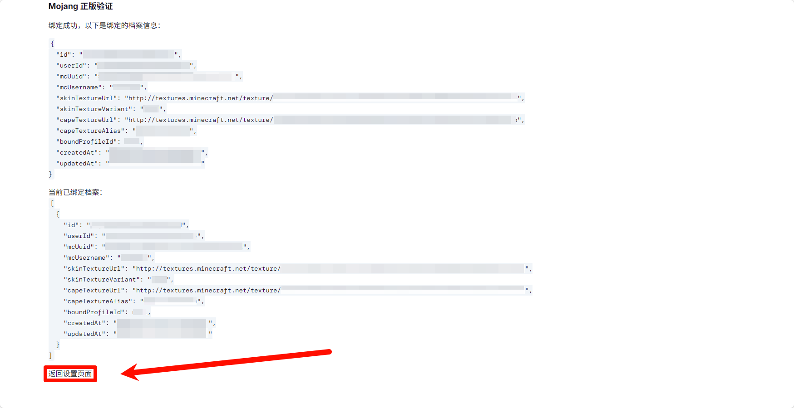

6. 在绑定到档案下拉菜单中选择要关联的档案（如主档案），即可将正版账户的皮肤应用到该档案中。

   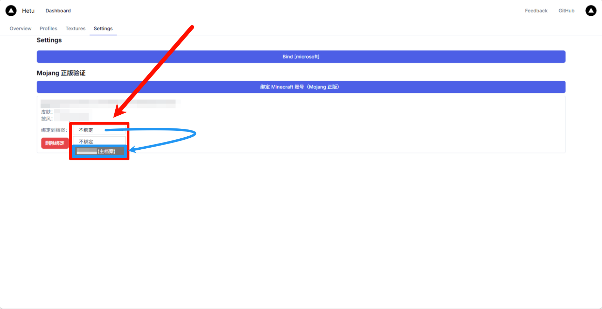

## 登录服务器

### Minecraft: Java Edition

#### PCL2 启动器

1. 启动 PCL2 启动器，下载 Minecraft: Java Edition 。
2. 打开 Minecraft: Java Edition 版本设置，滑动到最底下的服务器选项，在登录方式中选择第三方登录，并按照如下图方式输入内容：`https://api.losenone.cn/accounts/yggdrasil` 。

   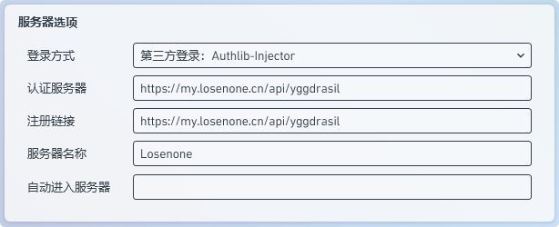

3. 配置完成后返回到启动器主页面，输入先前注册好的皮肤站帐户与密码，点击启动游戏即可。

#### HMCL 启动器

1. 点击账户右侧的 `+` 。
2. 登录方式选择 `authlib-injector 登录` 。
3. 点击 `管理认证服务器` 。
4. 在弹出的窗口内输入 `https://api.losenone.cn/accounts/yggdrasil` 并点击 `确认` 。
5. 在 `认证服务器` 的下拉列表中选中刚刚添加的认证服务器。
6. 填入你的皮肤站账户与密码，并点击 `确认` 。

   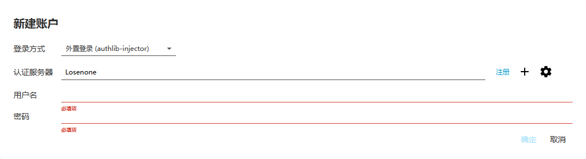
