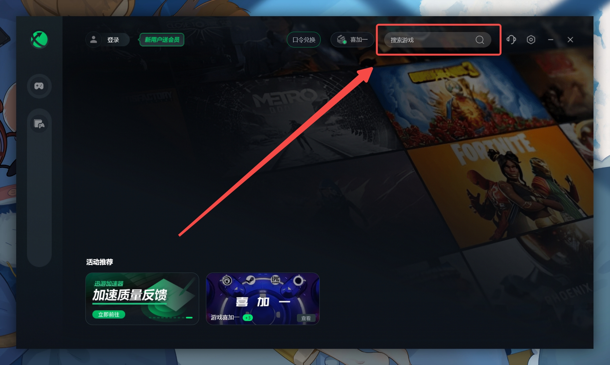
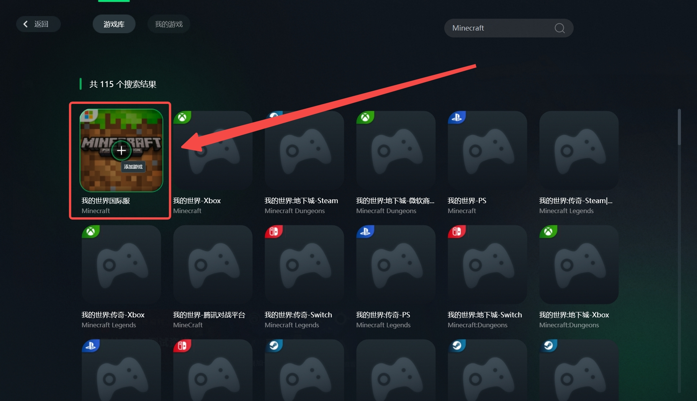
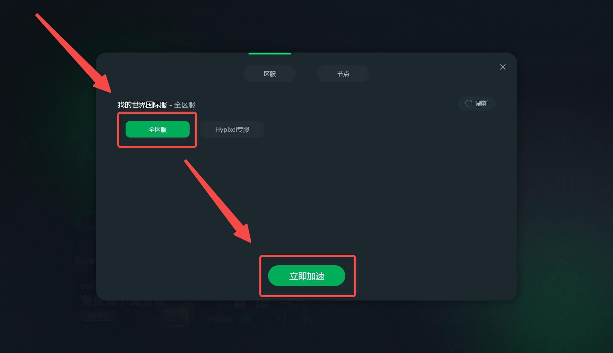
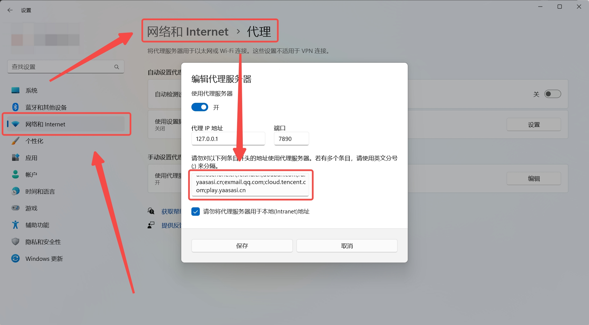
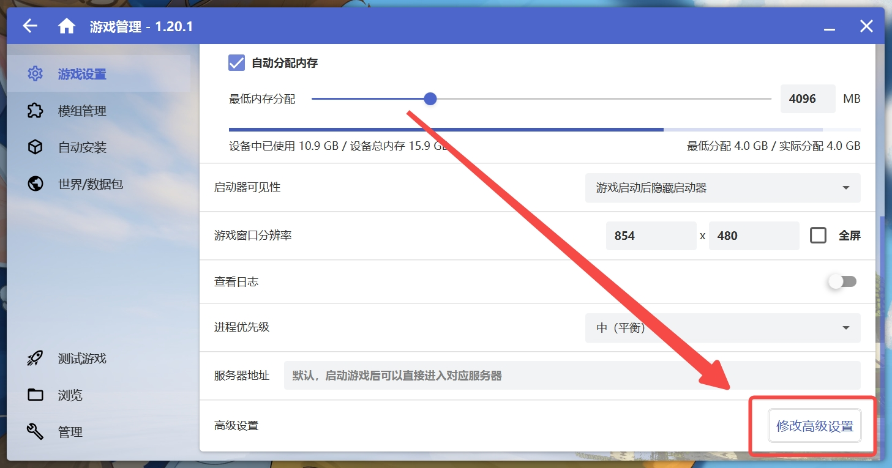
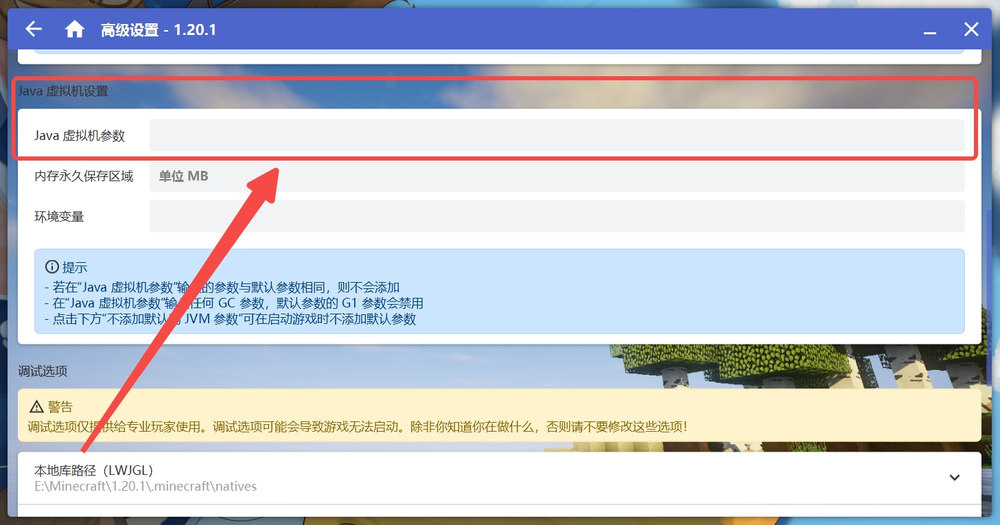
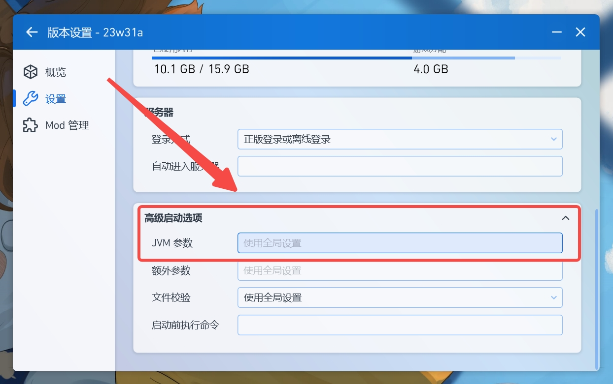

import Callout from 'nextra-theme-docs/callout'


# Minecraft Account Verification Failed

<Callout type="error" emoji="️🚫">
  This content is not available in your language. The following is available in Simplified Chinese.\
   ( ⓛ ω ⓛ &#42;)
</Callout>


## 前言

自 2023 年 10 月 01 日 00:00 起全国多地玩家无法连接到 Minecraft 账户验证服务器，并且无法正常验证账户、获取皮肤披风等资源以及登录开启正版验证的服务器。

目前我们已知受到影响的，与 Minecraft 有关联的域名：

- api.minecraftservices.com
- sessionserver.mojang.com
- api.mojang.com
- ...

全国多个地区访问上述域名受到不同程度的 DNS 污染或劫持，包含多个网络运营商（中国移动、中国联通），您可能还会遇到转跳到反诈中心网页的情况。\
目前明面上的原因是被国家反诈中心判定为诈骗网站，对于此事，我们建议您持续观望，切勿加入网络舆论。


## 解决方法

### 修改系统 Hosts 文件

以目前的状况来看失效，如果您实在想要尝试，请通过搜索引擎获得修改方式。

### 使用游戏加速器

您可以通过游戏加速器，来实现正常访问到受影响的 Minecraft 服务，这里我们以迅游加速器为例：

1. 启动迅游加速器，在右上角的搜索框键入 `Minecraft` ，轻按回车以搜索。

   

2. 右键点击将 `Minecraft 国际版` 添加到 `我的游戏` 。

<Callout emoji="🔔">
  请不要选择诸如 `Minecraft 国服` 、 `我的世界国服` 以及 `中国节点` 等加速方式。
</Callout>

   

3. 选择 `全区服` 节点，点击 `立即加速` ，等待迅游加速器加速完成后，启动 Minecraft 启动器开始游戏即可。

<Callout emoji="🔔">
  请不要选择 `中国` 节点，可以选择距离您自身所在地域近的国际节点或港澳台节点。
</Callout>

   

### 使用代理服务

在您使用的代理服务中，应有本地服务端口之类的信息，请记下 `IP` 与 `端口` ，将它们填入以下格式中，并保存下来：

```
-DsocksProxyHost=<IP> -DsocksProxyPort=<端口>
```

示例：

```
-DsocksProxyHost=<127.0.0.1> -DsocksProxyPort=<7890>
```

2. 在您使用的代理服务中，在 `系统代理绕过的域名 / IP 网段` 设置中，将归落原 Minecraft 服务器（例如：play.yaasasi.cn）的域名设置为绕过。

<Callout emoji="🔔">
  **请一定一定完成此项操作，如果未设置绕过，您与归落原 Minecraft 服务器之间的通信也将被代理，您的游戏延迟将非常高！**\
  如果您没有在您的代理服务中找到类似的设置，请打开 Windows 设置，在 `网络和 Internet` -> `代理` -> `手动设置代理` 板块中，找到 `使用代理服务器` 一栏，点击右侧 `编辑` ，在下图所示输入框内输入参数（例如：`;play.yaasasi.cn`），也可完成此操作。
</Callout>

   

#### HMCL 启动器

1. 运行 HMCL 启动器，点击 `版本列表` ，选择你所需的版本单击。
2. 勾选 `启用游戏特定设置（不影响其他游戏版本）` 或点击 `编辑全局版本设置` 。
3. 滑动到最底下，在高级设置一栏中找到并点击 `修改高级设置` 。

   

4. 在 `Java 虚拟机设置` 板块中，找到 `Java 虚拟机参数` 输入框，填入先前保存的代码。

   

5. 返回 HMCL 启动器主页，在确保代理服务正在运行且正常可用时，启动 Minecraft 开始游戏即可。

#### PCL2 启动器

1. 运行 PCL2 启动器，点击 `版本列表` ，选择你所需的版本单击。
2. 点击 `版本设置` ，在左侧边栏中选择 `设置` ，滑动到最底下，展开 `高级启动选项` 板块，找到 `JVM 参数` 输入框，填入先前保存的代码。

   

3. 返回 PCL2 启动器主页，在确保代理服务正在运行且正常可用时，启动 Minecraft 开始游戏即可。

### 使用 steamcommunity 302

steamcommunity 302 在 V12.1.29 版本新增了修复我的世界部分服务的模式，您可尝试使用。\
steamcommunity 302 原帖：[https://www.dogfight360.com/blog/686/](https://www.dogfight360.com/blog/686/)