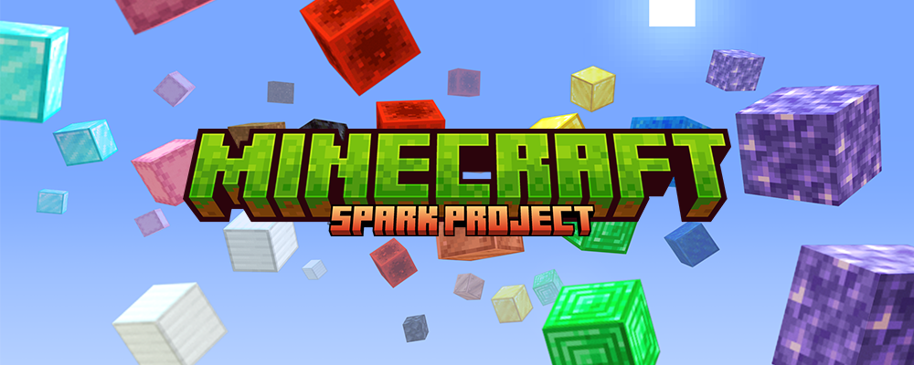

import Callout from 'nextra-theme-docs/callout'

# Playthrough · Ourmoe

<Callout type="error" emoji="️🚫">
  This content is not available in your language. The following is available in Simplified Chinese.\
   ( ⓛ ω ⓛ &#42;)
</Callout>

## 原初系列（Original Series）

原初系列（Original Series），是归落原推出的以公益、纯净生存为主要特点的 Minecraft 多人在线游戏服务器系列，由归落原创意团队企划的 Minecraft 多人在线游戏服务器项目，项目由归落原创意团队策划、运营与管理，洛书南社区提供服务器计算资源并推出。\
由此为社群带来良性、优质与美好的公益 · 纯净生存 Minecraft 社区服务器，历代周目均跟随 Minecraft 大版本更新而更新，为社群玩家们带来最新的游戏内容，以及一个和谐、多元、开放、包容、友爱的社群。\
感谢您选择我们，我们将一路前行。愿此行，终抵群星。

   

| 周目代号 | 周目历时 | 适用版本 | 文件体积 | 下载 |
| :----: | :----: | :----: | :----: | :----: |
| First | 2021.12.03 - 2022.06.30 | 1.17.1 | 15.09G | [官方源](https://files.losenone.cn/d/Ourmoe/Save/Playthrough/Original_Series/Ourmoe_Original_First.zip) |
| Second | 2022.07.01 - 2023.04.27 | 1.19.4 | 28.36G | [官方源](https://files.losenone.cn/d/Ourmoe/Save/Playthrough/Original_Series/Ourmoe_Original_Second.zip) |
| Third | 2023.06.26 - * | 1.20.4 | - | - |

## 群星系列（Groupstar Series）

群星系列（Groupstar Series），是归落原推出的以公益、趣味生存为主要特点的 Minecraft 多人在线游戏服务器系列，由归落原创意团队企划的 Minecraft 多人在线游戏服务器项目，项目由归落原创意团队策划、运营与管理。\
依托社群与 Minecraft 社区，我们带来更多内容、更多趣味与更多快乐的 Minecraft 社区服务器。\
欢迎你加入进来；参与其中；创造更多，让我们去更远的地方，见更亮的光。

   

| 周目代号 | 周目名称 | 周目历时 | 适用版本 | 文件体积 | 下载 |
| :----: | :----: | :----: | :----: | :----: | :----: 
| Martis | 荧惑 | 2023.01.01 - 2023.04.27 | 1.18.2 | 5.57G | [官方源](https://files.losenone.cn/d/Ourmoe/Save/Playthrough/Groupstar_Series/Ourmoe_Groupstar_Martls.zip) |
| Iuppiter | 岁星 | 2023.09.30 - 2023.10.01 | 1.18.2 | 657.87M | [官方源](https://files.losenone.cn/d/Ourmoe/Save/Playthrough/Groupstar_Series/Ourmoe_Groupstar_Iuppiter_First.zip) |
| Mercurius | 辰星 | - | 1.12.2 | - | - |

## 星火计划（Spark Project）

星火计划（Spark Project），是归落原推出的以公益、测试为主要特点的 Minecraft 多人在线游戏服务器系列，承载着我们对 Minecraft 新鲜事物的勇敢尝试，抑或是迸发的灵感与现实的碰撞。

   

| 周目代号 | 周目名称 | 周目历时 | 适用版本 | 文件体积 | 下载 |
| :----: | :----: | :----: | :----: | :----: | :----: |
| Departure Beta | 启程测试 | 2021.07.03 - 2021.11.30 | 1.17.1 | 2.48G | [官方源](https://files.losenone.cn/d/Ourmoe/Save/Playthrough/Spark_Project/Ourmoe_Spark_DepartureBeta.7z) |
| Air Island | 空岛生存 | 2021.08.28 - 2021.11.25 | 1.17.1 | 114.59M | [官方源](https://files.losenone.cn/d/Ourmoe/Save/Playthrough/Spark_Project/Ourmoe_Spark_AirIsland.zip) |
| Pioneer Test | 先锋测试 | 2023.04.23 - 2023.05.31 | 1.20 | 1.33G | [官方源](https://files.losenone.cn/d/Ourmoe/Save/Playthrough/Spark_Project/Ourmoe_Spark_PioneerTest.zip) |

## 其他周目

您是否在查找与归落原有关但非由归落原推出的社区服务器？请参照此表，寻过去之忆。
| 游戏 | 属性 | 备注 | 提供下载 | 如何下载 |
| :----: | :----: | :----: | :----: | :----: |
| Minecraft | 公开 | 于 2021 年以前推出 | 否 | 旧域下载 |
| Minecraft | 私有 | - | 否 | 来源社群 |
| Minecraft | 定制 | - | 否 | 定制来源 |
| Minecraft | 公开 | 由洛书南社区推出 | 是 | [前往页面](losenone_previous_playthrough) |
| Terraria | - | - | 否 | 来源社群 |
| 其他游戏 | - | - | 否 | 来源社群 |