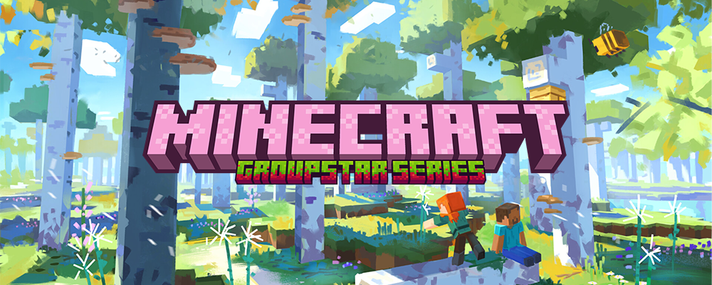
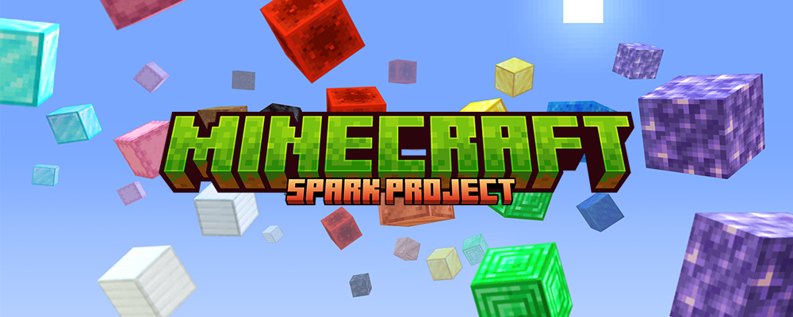
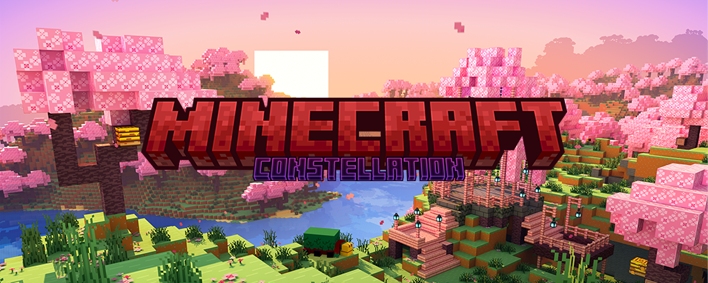

import Callout from 'nextra-theme-docs/callout'

# 归落原 · 历史周目

## 原初系列（Original Series）

原初系列（Original Series），是归落原推出的以公益、纯净生存为主要特点的 Minecraft 社区服务器系列，由归落原创意团队策划、运营与管理，洛书南社区提供服务器计算资源并推出。\
由此为社群带来良性、优质与美好的公益 · 纯净生存 Minecraft 社区服务器，历代周目均跟随 Minecraft 大版本更新而更新，为社群玩家们带来最新的游戏内容，以及一个和谐、多元、开放、包容、友爱的社群。\
感谢您选择我们，我们将一路前行。愿此行，终抵群星。

   

| 周目代号 | 周目历时 | 适用版本 | 文件体积 | 下载 |
| :----: | :----: | :----: | :----: | :----: |
| First | 2021.12.03 - 2022.06.30 | 1.17.1 | 15.09G | - |
| Second | 2022.07.01 - 2023.04.27 | 1.19.4 | 28.36G | - |
| Third | 2023.06.26 - 2024.06.13 | 1.20.4 | 22.88G | - |
| Fourth | 2024.06.28 - 2025.07.20 | 1.21.3 | 22.60G | - |
| Fifth | 2025.07.25 - 2026.06.17 | 1.21.11 | - | - |
| Sixth | 2026.06.17 - 2026.09.01 | 26.2 | - | - |

## 群星系列（Groupstar Series）

群星系列（Groupstar Series），是归落原推出的以公益、趣味生存为主要特点的 Minecraft 社区服务器系列，由归落原创意团队策划、运营与管理。\
依托社群与 Minecraft 社区，我们带来更多内容、更多趣味与更多快乐的 Minecraft 社区服务器。\
欢迎你加入进来；参与其中；创造更多，让我们去更远的地方，见更亮的光。

   

| 周目代号 | 周目名称 | 周目序号 | 周目历时 | 适用版本 | 文件体积 | 下载 |
| :----: | :----: | :----: | :----: | :----: | :----: | :----: |
| Martis | 荧惑 | Main | 2023.01.01 - 2023.04.27 | 1.18.2 | 5.57G | - |
| Iuppiter | 岁星 | Old | 2023.09.30 - 2023.10.01 | 1.18.2 | 657.87M | - |
| Iuppiter | 岁星 | 1st | 2024.01.12 - 2024.10.01 | 1.18.2 | 11.86G | - |
| Venus | 太白 | Main | 2024.10.12 - 2025.02.16 | 1.18.2 | - | - |
| Saturnus | 镇星 | Old | 2025.02.16 - 2025.02.25 | 1.12.2 | - | - |
| Iuppiter | 岁星 | 2nd | 2025.03.01 - 2025.05.06 | 1.18.2 | - | - |
| Mercurius | 辰星 | Main | 2025.09.06 - 2026.01.31 | 1.21.1 | - | - |
| Dubhe | 天枢 | Main | 2026.02.07 - 2026.09.01 | 1.19.2 | - | - |

## 星火计划（Spark Project）

星火计划（Spark Project），是归落原推出的以公益、测试为主要特点的 Minecraft 社区服务器系列，承载着我们对 Minecraft 新鲜事物的勇敢尝试，抑或是迸发的灵感与现实的碰撞。

   

| 周目代号 | 周目名称 | 周目历时 | 适用版本 | 文件体积 | 下载 |
| :----: | :----: | :----: | :----: | :----: | :----: |
| Departure Beta | 启程测试 | 2021.07.03 - 2021.11.30 | 1.17.1 | 2.48G | - |
| Air Island | 空岛生存 | 2021.08.28 - 2021.11.25 | 1.17.1 | 114.59M | - |
| Pioneer Test | 先锋测试 | 2023.04.23 - 2023.05.31 | 1.20 | 1.33G | - |

## 群英荟萃（Constellation）

群英荟萃（Constellation），是归落原推出的以公益、创作为主要特点的 Minecraft 社区服务器，携手同行，共创属于我们的美好世界。

   

| 周目阶段 | 阶段历时 | 适用版本 | 文件体积 | 下载 |
| :----: | :----: | :----: | :----: | :----: |
| Step1 | 2026 - * | - | - | - |

## 其他周目

您是否在查找与归落原有关但非由归落原推出的社区服务器？请参照此表，寻过去之忆。
| 游戏 | 属性 | 备注 | 提供下载 | 如何下载 |
| :----: | :----: | :----: | :----: | :----: |
| Minecraft | 公开 | 于 2021 年以前推出 | 否 | 旧域下载 |
| Minecraft | 私有 | - | 否 | 来源社群 |
| Minecraft | 定制 | - | 否 | 定制来源 |
| Minecraft | 公开 | 由洛书南社区推出 | 是 | [前往页面](losenone_previous_playthrough) |
| Terraria | - | - | 否 | 来源社群 |
| 其他游戏 | - | - | 否 | 来源社群 |

## 版权信息

<Callout emoji="⚡️">
本页共享的周目存档采用 [MCSCL 1.0 BY-NC-ND-SHN](https://blog.yaasasi.cn/mcscl) 进行许可。

在遵守本许可证条款的前提下，您可以自由地：

- 单机体验 — 导入个人客户端进行单机游玩、观赏、探索及摄影。
- 本地备份 — 在个人设备上复制与保存存档副本以防止数据丢失。
- 创作修改 — 在单机或测试环境中对地图进行创作与修改（仅限个人自用）。

惟须遵守下列条件：

- 署名 (BY) — 您必须给出适当的署名，保留本许可证文本，清晰标注原社区及建筑师名称，并提供指向原发布源的链接。
- 非商业性使用 (NC) — 您不得将本作品及其提取内容用于任何商业盈利目的（包括但不限于付费下载、出售、收费展览或搭载商业广告）。
- 禁止二次分发 (ND) — 未经许可，您不得将本存档源文件重新上传至任何网络平台，亦不得将修改后的版本作为“新作品”或“二创版本”公开发布。
- 严禁开服 (SHN) — 严禁将本存档（或其中任意部分）用于搭建任何形式的联机或公共服务器。

声明与免责：

- 按“现状”提供 (As-Is) — 本存档按现状提供，许可人不保证存档无错误、红石损坏或版本兼容性问题。
- 第三方 IP 与版权追溯 — 存档内如包含第三方已知 IP 形象或非原创素材，其版权归原权利人所有。使用者严禁将相关内容用于商业变现，由此引发的侵权责任由使用者自行承担。
</Callout>