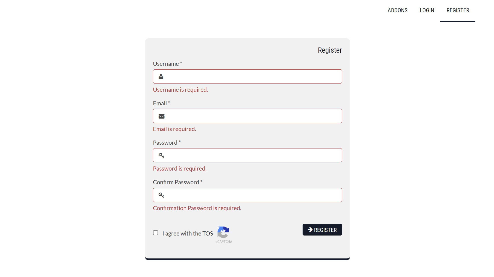
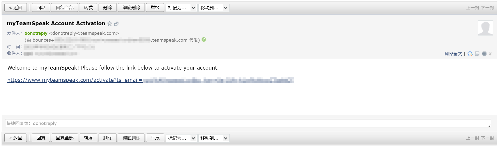
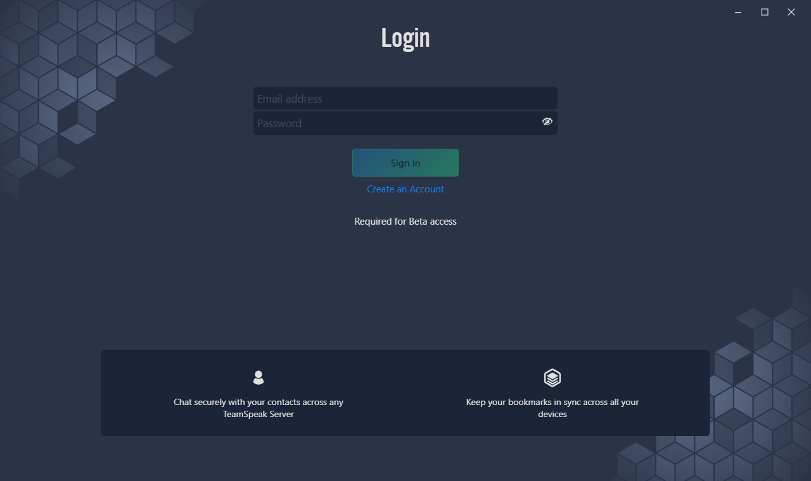
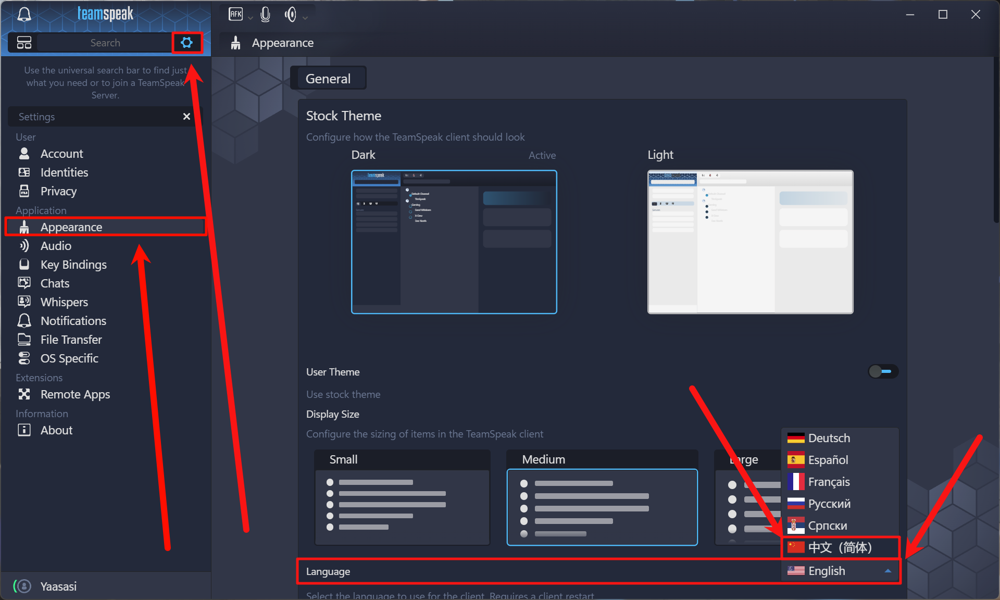
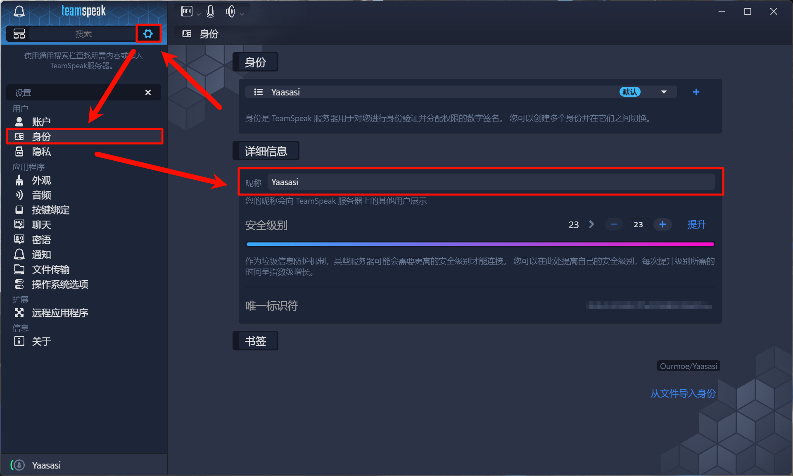
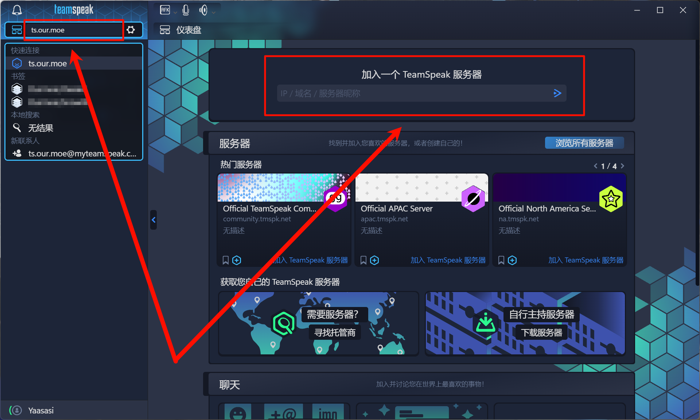

import Callout from 'nextra-theme-docs/callout'

# TeamSpeak User Guide

<Callout type="error" emoji="️🚫">
  This content is not available in your language. The following is available in Simplified Chinese.\
   ( ⓛ ω ⓛ &#42;)
</Callout>

## 前言

TeamSpeak 是一款 VoIP 语言通话软件，使用者可以用耳机和麦克风，通过客户端软件连线到指定的服务器，与在服务器内频道的其他使用者进行通话。是一种很像电话会议的方式。 通常 TeamSpeak 的使用者大多为多人连线游戏的玩家，与同队伍的玩家进行通讯。在游戏的对战方面，具有低内存占用、低延迟、高清晰度、高可靠性等优点，是一种非常好的游戏交流方式。

## 快速开始

目前 TeamSpeak 的客户端有两个版本（TeamSpeak3 与 TeamSpeak5），您仅需安装一个即可。

| 客户端 | 属性 | 优点 | 官方中文 | 注册账户 |
| :----: | :----: | :----: | :----: | :----: |
| TeamSpeak3 | 稳定版 | 内存占用小、极简 UI、稳定版本 | ✕ | 可选 |
| TeamSpeak5 | 测试版 | 更为便利、现代 UI、持续更新 | ✓ | 必须 |

### 安装客户端（TS5）

请根据您设备的系统环境下载所需 TeamSpeak5 客户端安装包，并安装 TeamSpeak5 客户端。

| TeamSpeak5 | 版本 | 下载 |
| :----: | :----: | :----: |
| Windows x64 | V5.0.0-beta77 | [官方源](https://teamspeak-mirror.wevg.org/pre_releases/client/5.0.0-beta77/teamspeak-client.msi) |
| MacOS | V5.0.0-beta77 | [官方源](https://teamspeak-mirror.wevg.org/pre_releases/client/5.0.0-beta77/teamspeak-client.dmg) |
| Linux | V5.0.0-beta77 | [官方源](https://teamspeak-mirror.wevg.org/pre_releases/client/5.0.0-beta77/teamspeak-client.tar.gz) |

#### 注册 myTeamSpeak 账户

<Callout emoji="⚡️">
  TeamSpeak5 客户端强制要求登录 myTeamSpeak 账户，若您已经拥有 myTeamSpeak 账户可跳过此步骤。如果您无意注册 myTeamSpeak 账户，也可选择使用 TeamSpeak3 客户端，无需 myTeamSpeak 账户也可使用。
</Callout>

请前往 [https://www.myteamspeak.com/register](https://www.myteamspeak.com/register) 注册 myTeamSpeak 账户，键入您的用户名、邮箱、密码以及同意服务条款并提交注册表单。

   

注册表单提交成功后，您的邮箱将会收到验证邮件，点击验证链接以完成注册。

   

#### 登录客户端

当您首次启动客户端，应当会提示您登录 myTeamSpeak 账户，键入您先前注册 myTeamSpeak 账户的用户名与密码以登录。

   

#### 修改客户端语言

点击左上角“齿轮”图标打开设置页面，在左侧侧边栏切换到 Appearance（外观）选项卡，找到 Language（语言）配置项，将语言修改为“中文（简体）”，修改完成后重启客户端以应用设置。

   

#### 修改频道展示名称

点击左上角“齿轮”图标打开设置页面，在左侧侧边栏切换到 Identities（身份）选项卡，找到 Details（详细信息）/ Nickname（昵称）配置项，自定义您的频道展示名称。

   

#### 连接服务器

您可在客户端左上角的搜索框中键入域名（或 IP 地址），按下回车键以连接至服务器，也可以在主界面的完成连接服务器的操作，更多进阶操作欢迎您自行探索。

<Callout emoji="⚡️">
  [点击此处](ts3server:/ts.our.moe)一键加入我们提供的 TeamSpeak 服务器，您也可以通过服务器地址加入：ts.our.moe 。
</Callout>

   

### 安装客户端（TS3）

请根据您设备的系统环境下载所需 TeamSpeak3 客户端安装包，并安装 TeamSpeak3 客户端。

| TeamSpeak3 | 版本 | 下载 |
| :----: | :----: | :----: |
| Windows x64 | V3.6.2 | [官方源](https://teamspeak-mirror.wevg.org/releases/client/3.6.2/TeamSpeak3-Client-win64-3.6.2.exe) |
| MacOS | V3.6.2 | [官方源](https://teamspeak-mirror.wevg.org/releases/client/3.6.2/TeamSpeak3-Client-macosx-3.6.2.dmg) |
| Linux | V3.6.2 | [官方源](https://teamspeak-mirror.wevg.org/releases/client/3.6.2/TeamSpeak3-Client-linux_amd64-3.6.2.run) |

#### 汉化客户端

TeamSpeak 官方并不提供 TeamSpeak3 客户端的简体中文界面，如果您需要使用简体中文界面，请下载[中文语言包](https://github.com/VigorousPro/TS3-Translation_zh-CN/releases/download/snapshot/Chinese_Translation_zh-CN.ts3_translation)并安装即可。

#### 连接服务器

在您安装好 TeamSpeak3 客户端后，打开 Connections（连接）菜单，点击 Connect（连接）按钮，打开连接窗口。\
填写您要连接的服务器地址，和您的用户名，点击 Connect（连接）按钮，即可连接至服务器。

<Callout emoji="⚡️">
  [点击此处](ts3server:/ts.our.moe)一键加入我们提供的 TeamSpeak 服务器，您也可以通过服务器地址加入：ts.our.moe 。
</Callout>

   